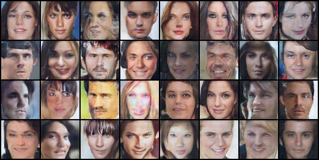
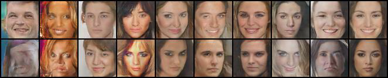

# GAN and ACGAN face generation

This is a project part of the course "Deep Learning and Computer Vision" of National Taiwan University. A GAN and an ACGAN is implemented for generating human face images.
The GAN generates random faces, while the ACGAN generates the same faces twice, once smiling (second tag at '1') and once not smiling (second tag at '2').

### Dataset
In the starter code of this repository, we have provided a shell script for downloading and extracting the dataset for this assignment. For Linux users, simply use the following command.

    bash ./get_dataset.sh
The shell script will automatically download the dataset and store the data in a folder called `hw3_data`. Note that this command by default only works on Linux. If you are using other operating systems, you should download the dataset from [this link](https://www.dropbox.com/s/65qdt9rkt808an4/hw3_data.zip) and unzip the compressed file manually.

To run the code use the following commands:

    CUDA_VISIBLE_DEVICES=GPU_NUMBER bash ./hw3_p1p2.sh $1

-   `$1` is the folder to which you should output your `fig1_2.jpg` and `fig2_2.jpg`.

This will generate the faces saved in the seed files. To change the generated faces, delete the seed files and run save_image_ACGAN.py or save_image_GAN.py and new seed files will be generated with different faces.

### GAN example

### ACGAN example

